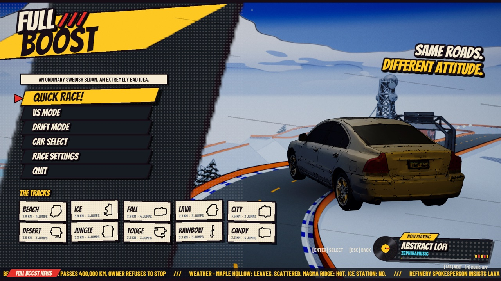
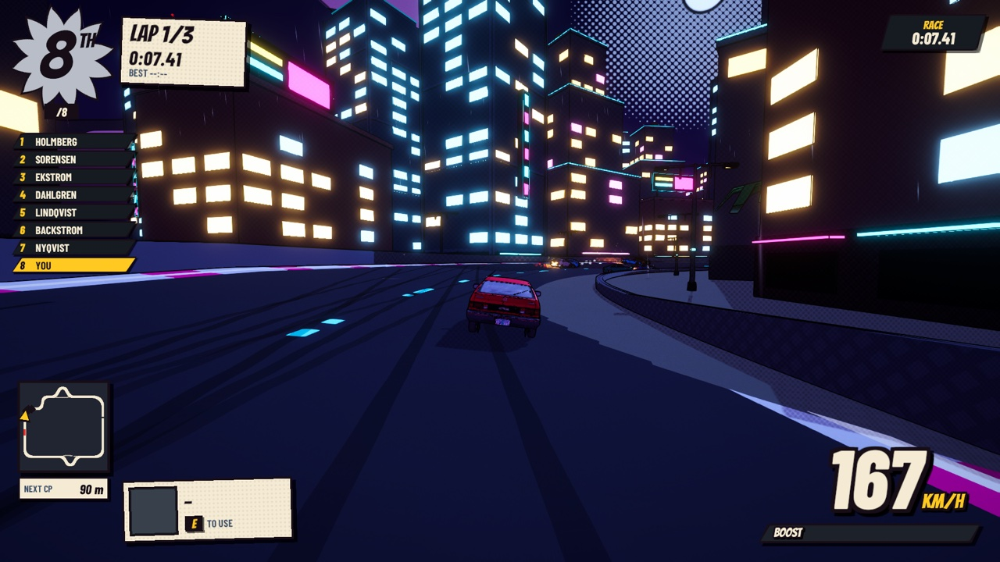
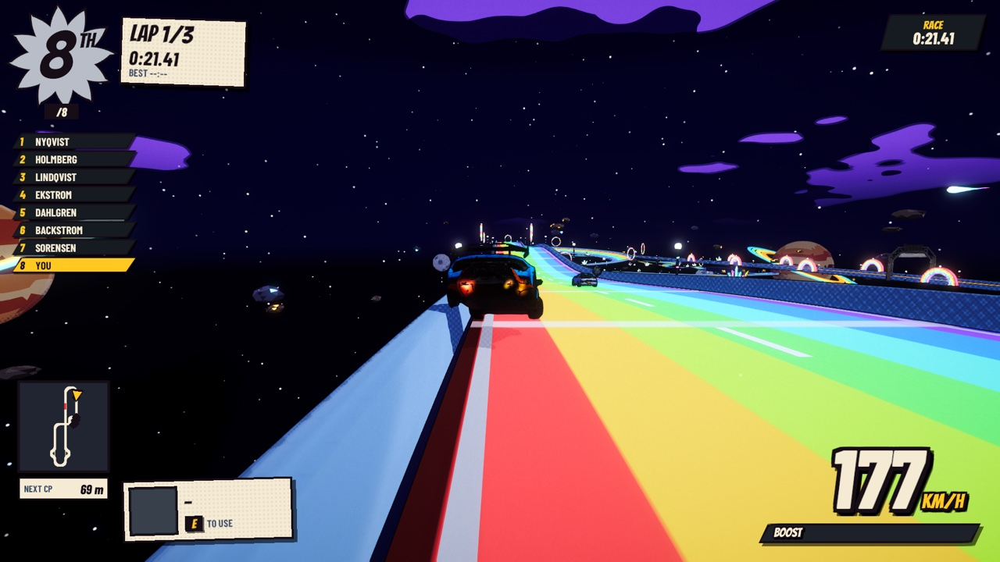
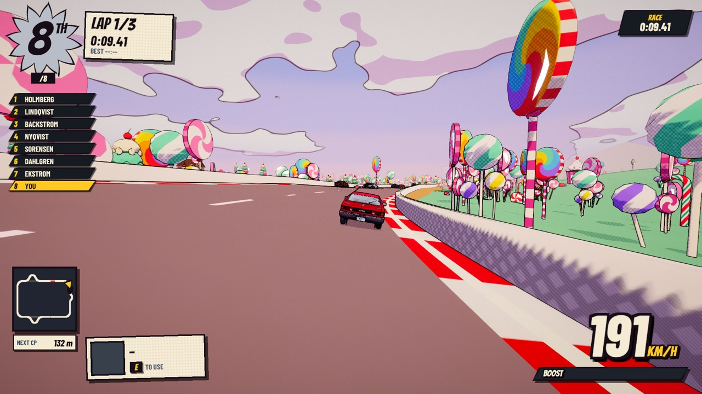
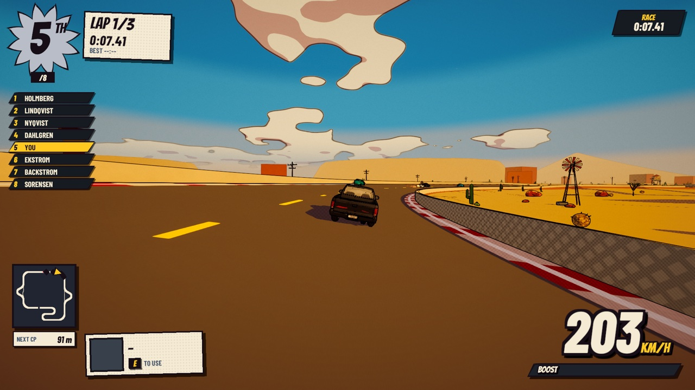
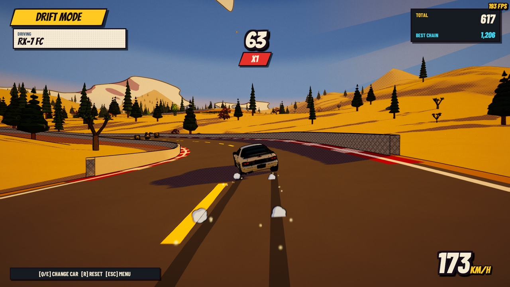
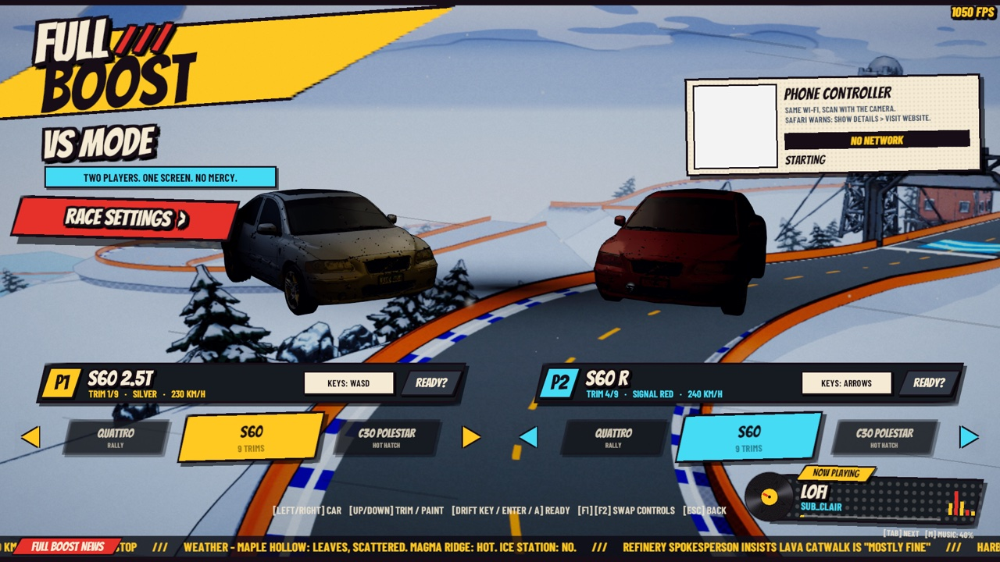
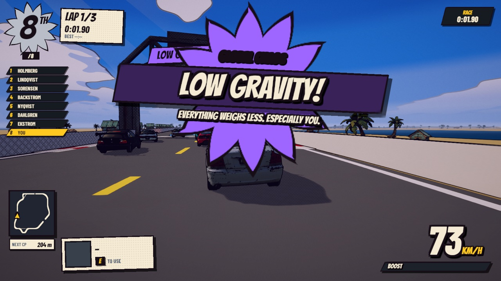
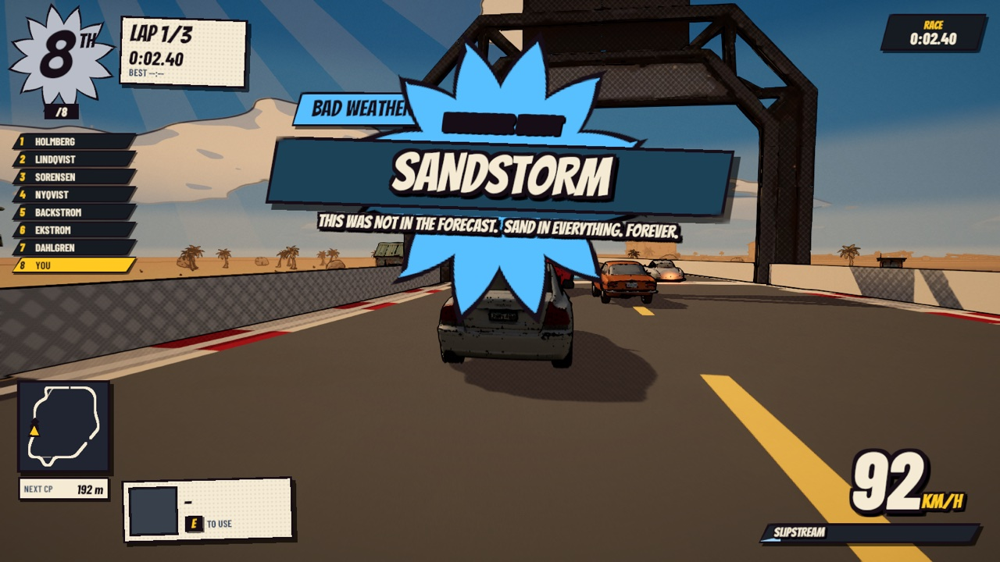

# FULL BOOST

**An ordinary Swedish sedan. An extremely bad idea.**

A comic-book arcade racer by **Rockadoo Studios**: ten tracks, 33 cars, drifting, power-ups that ruin friendships, split-screen VS, and your phone as a controller.



## Download

**[Download FULL BOOST v1.0 for macOS](../../releases/latest)** (Apple Silicon: M1 or newer, macOS 12+)

1. Download `FullBoost-v1.0-macOS.zip` from the latest release and unzip it.
2. Move **FullBoost.app** to your Applications folder.
3. The first time, **right-click the app → Open → Open**. The app isn't notarized by Apple, so macOS asks once.
   - If macOS says the app "is damaged" or "can't be opened", run this once in Terminal, then open it normally:
     ```bash
     xattr -dr com.apple.quarantine /Applications/FullBoost.app
     ```

## What's in v1

| | |
|---|---|
|  |  |
|  |  |

- **10 tracks:** Beach, Ice, Fall, Lava, Neon City, Desert Canyon, Jungle Ruins, Mountain Touge, Rainbow Road and Candyland. Each has shortcuts, jumps and its own weather.
- **33 cars:** saloons, JDM legends, muscle, supercars, a rally legend, a pickup truck with a grudge, and a work van. Each handles differently, and some have trims to switch between.
- **Drift mode:** an open world with a desert gas station, a skid pad and a mountain pass. Chain drifts for points and swap cars on the fly (**Q / E**, or **LB / RB** on a gamepad).
- **Split-screen VS:** two players on one screen, on keyboard, gamepads, or **your phone as a controller** (scan the QR code, same Wi-Fi).
- **14 power-ups**, including Repulsor, Traffic Jam, Low Gravity, Road Works, Tow Cable and Bad Weather.
- **A lofi radio** with a now-playing card, and full options for audio, display, graphics and gameplay.

| | |
|---|---|
|  |  |
|  |  |

## Controls

| Action | Keyboard | Gamepad |
|---|---|---|
| Steer / throttle / brake | WASD or arrow keys | Left stick, RT / LT |
| Drift | Space | A |
| Boost | Left Shift | X |
| Use power-up | E | B |
| Reset car | R | Back |
| Camera | C | Y |
| Pause | Esc | Start |
| Next song / music volume | Tab / M | |
| Drift mode: previous / next car | Q / E | LB / RB |

## Credits

A game by **Rockadoo Studios**.

Music: lofi tracks by prettyjohn1, sub_clair, zephiramusic, kulakovka and Alex Morgan, used with permission.

Car and brand names belong to their respective owners. FULL BOOST is a free fan-made game, not affiliated with or endorsed by any manufacturer.

Made with Unity.
